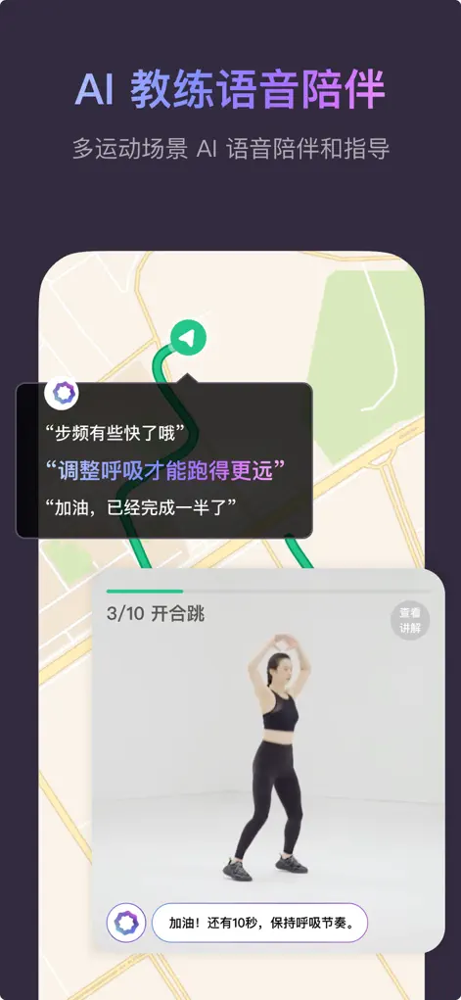
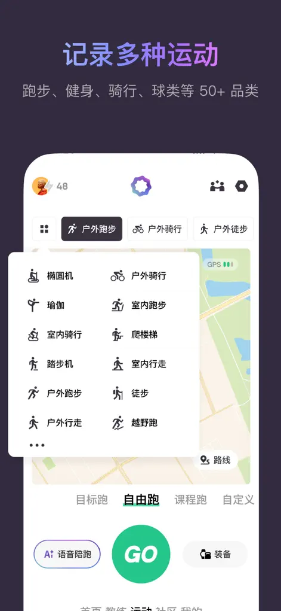
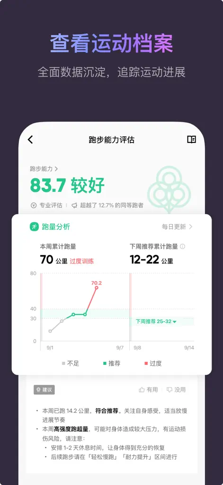
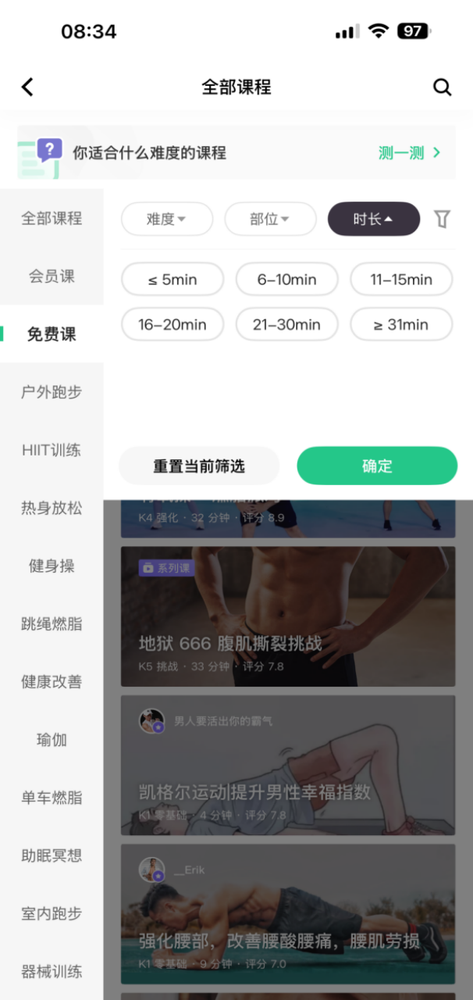
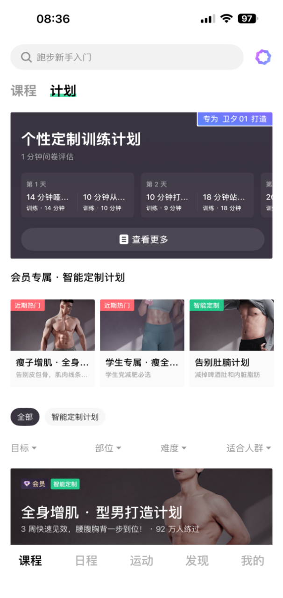
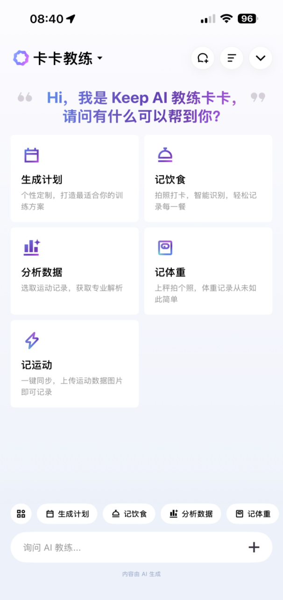
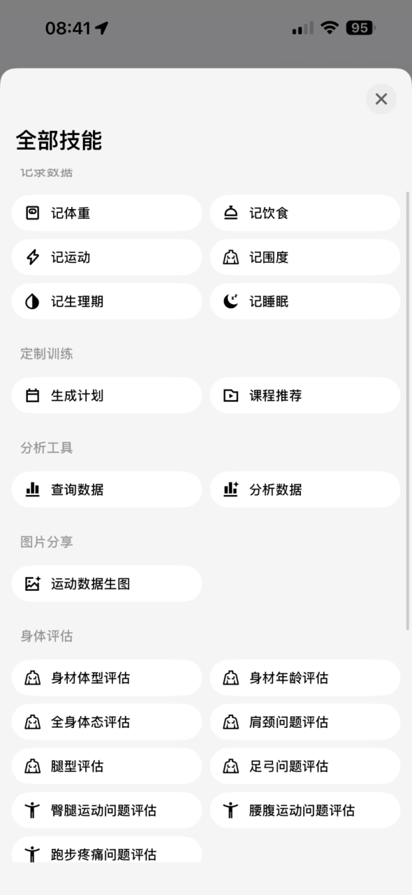

# Keep UI 界面与设计结构审阅

查证日期：2026-08-28  
范围：Keep 9.0 / 9.1 的公开可见主要界面与核心流程。  
说明：无法从公开渠道看到的登录态、会员支付、灰度实验与设备专属页面不冒充“完整真机截图”，统一列入待验证清单。

## 一、当前公开版的核心结构

Keep 9.0 将底部导航重组为：

`课程 → 日程 → 运动 → 发现 → 我的`

这是产品结构最重要的变化：三个一级入口直接服务“找到训练—安排训练—开始训练”，社区与商业内容退到次级位置。

```text
课程
├─ 课程 / 计划双页签
├─ 全部课程 / 免费课 / 直播课 / 动作库 / 找路线
├─ 目标、部位、难度、时长筛选
└─ 课程卡片 → 详情 → 开始跟练

日程
├─ 今日训练
├─ 周期计划
├─ AI 生成或调整计划
└─ 完成进度与提醒

运动
├─ 跑步 / 健身 / 骑行 / 步行 / 50+ 运动
├─ 目标跑 / 自由跑 / 课程跑 / 自定义
├─ 运动中数据、语音、路线或动作演示
└─ 结束记录 → 分析 → 建议

发现
├─ 社区 / 推荐
├─ 奖牌 / 比赛 / 路线
└─ 活动与内容分发

我的
├─ 数据概览 / 全部数据 / 运动记录
├─ 课程、活动、饮食、身体数据
├─ 设备、家庭、团队、订单与帮助
└─ AI 教练与身体评估入口
```

## 二、Keep 9.1 官方商店截图

以下 7 张图来自开发者提交到 App Store 的官方商店素材，适合确认 Keep 当前公开主打的能力，但它们是营销编排图，不等于每个页面的完整真实操作态。

### 1. AI 教练首页


结构：欢迎语 + 四个高频能力快捷入口 + 底部输入框。AI 被设计成任务路由器，不要求用户先学会菜单。

### 2. AI 定制运动计划


结构：AI 解释 + 加入/修改双操作 + 计划卡片。卡片同时显示周期、训练日、有氧/无氧比例和预计消耗。

### 3. 运动中 AI 语音陪伴



结构：地图或运动背景 + 短句语音反馈 + 当前动作小窗 + 次数/进度。指导被压缩到短句，不占主画面。

### 4. 拍照识别饮食与运动


结构：识别对象 → 用户确认 → 生成结构化记录。识别后保留删除/纠错入口，避免错误数据直接进入档案。

### 5. 多运动记录入口



结构：常用运动横向快捷区 + 全部运动面板 + 模式切换 + 中央主开始按钮。高频操作与长尾项目分层。

### 6. 运动档案与分析



结构：能力评分 + 周训练量趋势 + 推荐区间 + 文字结论。重点不是只报数字，而是告诉用户“是否过量、下周建议多少”。

### 7. 活动、赛事与奖牌


结构：频道导航 + 功能入口 + 双列活动卡。商业与社区内容采用高密度图片流，和训练工具页的低密度结构明显区分。

## 三、Keep 9.0 实际页面截图

以下截图来自 2026-04-28 的 Keep 9.0 产品体验文章，用于补足商店图没有展示的真实导航、筛选和页面组织。

### 8. 新版课程首页


变化：从旧版双列瀑布流改为单列课程列表；封面、课程名、难度、时长、官方标识和评分在一条卡片中完成判断。

### 9. 课程筛选层



结构：左侧课程类型 + 顶部条件维度 + 中部选项 + 底部重置/确认。适合条件多的内容库，但手机端占屏较大。

### 10. 计划页



结构：个性定制训练计划主卡 + 会员计划横卡 + 目标/部位/难度/人群筛选 + 计划列表。

### 11. 运动启动页


结构：运动类型切换 + 模式切换 + 目标设置大卡 + 语音陪跑 + 音乐/装备 + 中央 GO。单一主任务非常明确。

### 12. 我的 / 全部数据


结构：数据概览、全部数据、运动记录三层；核心指标卡片化，再进入趋势报告。空数据不硬凑结论。

### 13. 个人中心旧结构对照


这张保留作演进对照：入口过多、会员与权益权重偏大、层级拥挤。我们的产品不应照搬这种“宫格堆入口”的方式。

### 14. AI 教练任务首页



结构：能力卡片 + 快捷动作 + 输入框。用户既可点击明确任务，也可自然语言表达需求。

### 15. AI 教练全部技能



结构：记录数据、定制训练、分析工具、图片分享、身体评估分组。功能很多，但按用户意图分组，而不是按技术模块分组。

### 16. AI 问答结果页


结构：用户问题 + 分段回答 + 下一步建议问题 + 反馈/复制/分享 + 底部继续输入。回答会把用户引向下一项产品动作。

## 四、旧版对照：为什么 Keep 要改


旧版的问题很典型：顶部频道过多、推荐与广告混排、双列内容流信息密度过高、运动主任务不突出。9.0 的改版方向不是“换颜色”，而是重新分配一级入口与信息优先级。

## 五、完整用户流程与截图覆盖

| 用户阶段 | 一级页面 | 关键二级页面 | 当前证据 |
|---|---|---|---|
| 初次进入 | 引导、登录、目标与身体信息 | 权限、设备绑定 | 公开截图不足，待真机验证 |
| 找训练 | 课程 | 搜索、筛选、课程详情、动作库 | 已覆盖列表与筛选；详情待补 |
| 定计划 | 日程 / 计划 | 问卷、AI 生成、调整、周日程 | 已覆盖计划结果；问卷与日历待补 |
| 开始运动 | 运动 | 运动类型、目标、装备、语音 | 已覆盖启动页 |
| 运动进行中 | 跑步/跟练 | 实时数据、动作演示、语音、暂停 | 商店宣传图覆盖，真实完整态待补 |
| 运动结束 | 训练结果 | 心率、消耗、完成度、AI 建议、分享 | 公开截图不足，待真机验证 |
| 看变化 | 我的 / 数据 | 运动档案、趋势、能力、身体年龄 | 已覆盖数据概览与跑步分析 |
| 管饮食 | AI 教练 / 饮食 | 拍照、识别、纠错、热量缺口 | 商店宣传图覆盖，真实列表待补 |
| 参与活动 | 发现 | 社区、比赛、奖牌、路线 | 已覆盖活动/奖牌页 |
| 管理账户 | 我的 | 会员、设备、隐私、订单、帮助 | 旧版结构对照；当前页待补 |

## 六、设计结构总结

### 值得借鉴

- 训练相关一级入口占 3/5，产品重心很明确。
- 列表卡片直接给出做决定所需的信息：目标、难度、时长、评分、消耗。
- 运动页只保留一个强主按钮，避免开练前犹豫。
- 数据页把“数字—结论—建议”串成一条链，而不是只展示仪表盘。
- AI 入口按任务组织：生成计划、记录、分析、评估，降低用户提问成本。
- AI 结果不止输出文字，还给下一步操作入口。

### 不建议照搬

- 商店宣传图的紫色渐变是营销外壳，不是完整产品设计系统。
- 旧版个人中心和首页入口过密，不适合我们强调“打开就练”的产品定位。
- 课程筛选层选项很多，未来移动端应优先常用条件，其余折叠。
- 活动页双列图流适合内容消费，不适合实时训练页。
- Keep 的 AI 功能很广，我们不应一次性复制；优先做动作纠正、训练总结、计划调整三条闭环。

## 七、来源与版本说明

- Apple App Store，Keep 9.1.20：<https://apps.apple.com/cn/app/id952694580>
- 小米应用商店，Keep 9.1.20：<https://app.mi.com/details?id=com.gotokeep.keep>
- Keep 9.0 产品体验与界面截图：<https://www.woshipm.com/evaluating/6385599.html>
- App Store 截图镜像与版权说明：<https://mwm.ai/ja/apps/keep-ai/952694580>

截图、商标与界面版权归 Keep 及相应权利人所有。本文件仅用于竞品研究和内部设计讨论，不作为可直接复制的素材库。
