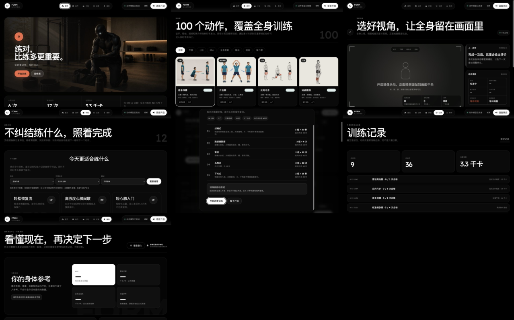
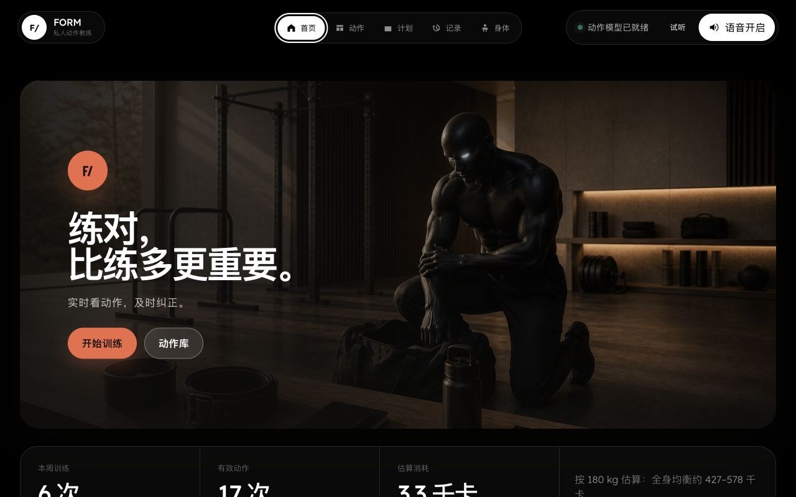
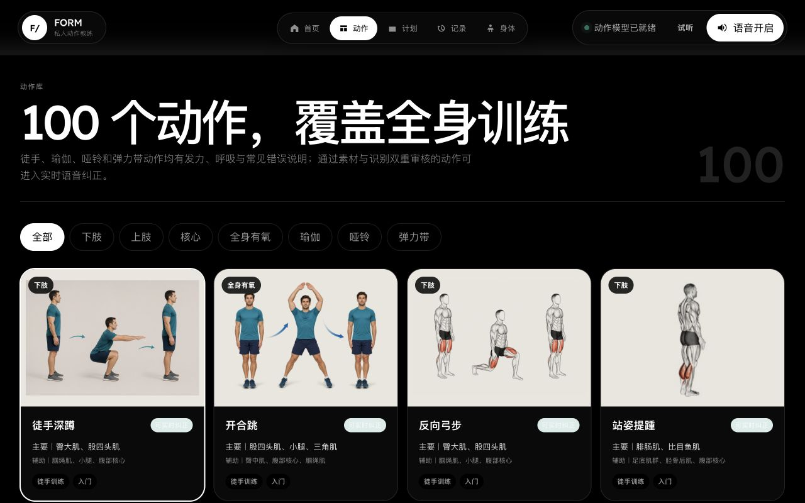
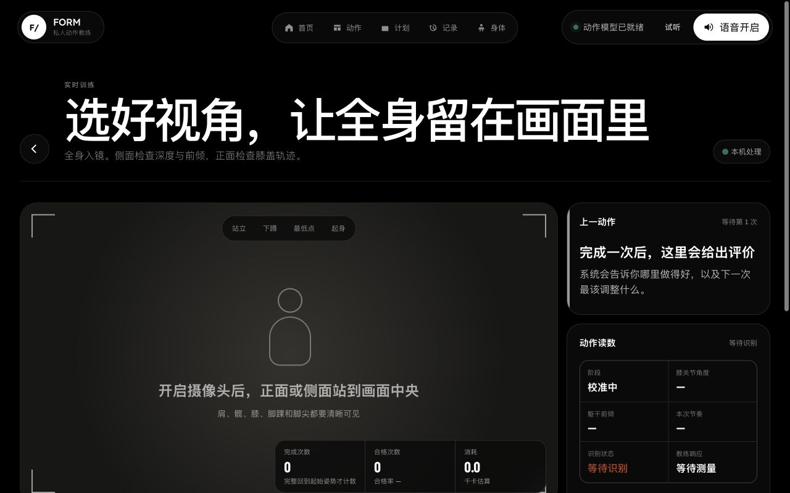
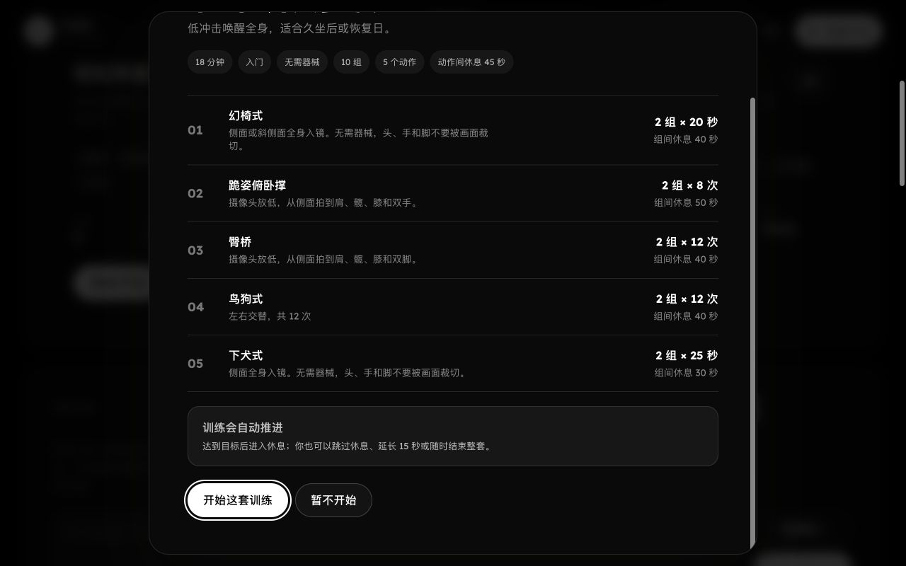
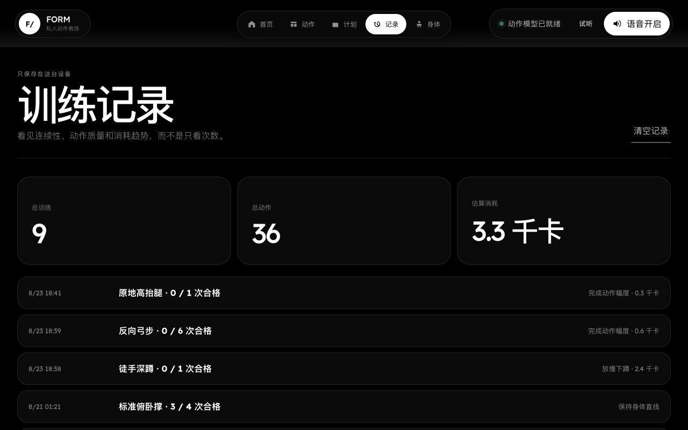
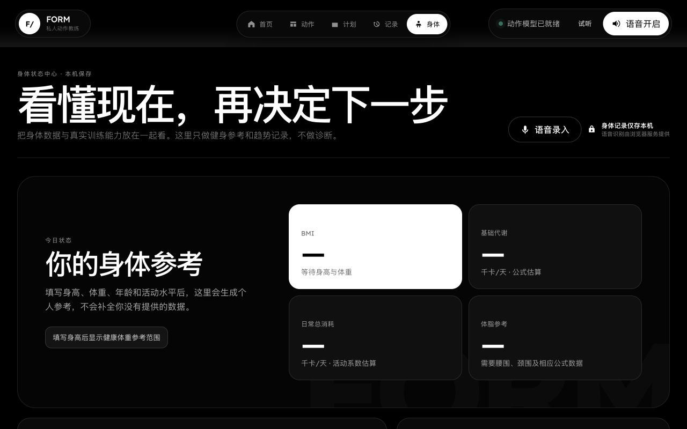

# FORM 界面与功能台账

日期：2026-08-26

## 结论

当前问题不是某个圆角或颜色，而是全站缺少清晰的视觉主次：大标题、黑色面板和细边框被重复使用，导致每一页看起来相似、功能重点不突出。建议先建立一套设计系统，再按用户训练路径逐页改造，不直接套用一张落地页模板。

## 页面台账

| 编号 | 界面 | 当前功能 | 当前主要问题 | 优先级 | 建议改造重点 |
| --- | --- | --- | --- | --- | --- |
| 00 | 全局导航与状态栏 | 首页、动作、计划、记录、身体切换；模型状态；试听；语音开关 | 三组胶囊悬浮在顶部，视觉较碎；品牌、主导航和系统状态争夺注意力；手机端底栏占用训练画面 | P0 | 合并为单一产品导航；训练时切换为精简教练栏；保留全局语音状态但降低存在感 |
| 01 | 首页 | 品牌封面、开始训练、进入动作库、周训练数据、今日计划 | 封面人物可保留，但导航与封面不是同一套品牌语言；下方数据区像表格；首页缺少“今天该做什么”的明确主任务 | P1 | 保留人物封面；把主入口收敛为“继续训练/今日计划”；增加进度与最近问题摘要 |
| 02 | 动作库 | 100 个动作；部位/器械筛选；肌群、难度、实时纠正状态 | 真人图、线稿解剖图混用；四列信息密集；卡片黑底过重；缺少搜索、收藏和适合我的筛选 | P0 | 统一动作素材；重做卡片层级；加入搜索、收藏、可纠正筛选；详情与开始训练分开 |
| 03 | 实时训练 | 摄像头、动作阶段、次数、合格率、消耗、动作读数、语音纠正 | 摄像区占比大但状态表达弱；未开启时仍显示抽象火柴人；关键按钮在首屏下方；右侧读数像后台面板；纠正信息没有形成清晰优先级 | P0 | 以“摄像画面 + 一条当前指导 + 次数”为核心；开始/暂停/结束固定可见；读数折叠；用颜色和短动画标出身体问题 |
| 04 | 计划中心 | 身体条件推荐；目标/时间/器械筛选；自定义要求；收藏计划；12 套固定计划 | 首屏标题占空间过多；推荐器和计划卡片同质；内容长且没有训练周期概念；自定义 AI 入口不够像智能功能 | P1 | 改为“今日推荐、我的计划、计划库”三层；推荐理由可解释；AI 定制做成对话式生成流程 |
| 05 | 计划详情 | 动作顺序、组数、次数/时长、组间休息、开始整套训练 | 弹窗内容过长；开始按钮在底部；缺少动作图和总训练结构；用户难以预判训练负担 | P0 | 顶部显示总时长/总组数/强度；动作缩略图；底部固定开始按钮；支持替换单个动作 |
| 06 | 训练记录 | 总训练、总动作、热量、历史训练列表 | 数据只有累计值，缺少趋势；列表像日志；合格率、问题和训练量无法对比；清空记录过于显眼 | P1 | 增加周/月趋势、肌群分布、动作质量变化；历史记录进入单次详情；弱化删除操作 |
| 07 | 身体中心 | BMI、基础代谢、日常消耗、体脂参考；身体档案；趋势；器械/徒手能力；语音录入 | 首屏大面积空白；一个白卡与其他黑卡无逻辑；真正的数据输入在下方；语音入口与表单割裂 | P0 | 首屏先给“当前状态 + 需要补充的数据”；输入、语音和结果同屏联动；公式说明按需展开 |
| 08 | 语音录入层 | 连续听写、文本修改、解析身体指标或训练要求、确认保存 | 功能分散在身体页和计划页；用户不清楚当前会填到哪里；识别、编辑、应用三个阶段缺少统一样式 | P0 | 使用统一底部面板：录音中 → 可编辑文本 → 识别字段预览 → 确认应用；清楚说明本机/联网状态 |
| 09 | 训练总结 | 次数、合格次数、节奏、问题、响应时间、热量、AI/本机建议、下一组 | 当前页必须完成训练后才能进入；总结指标很多但缺少一个明确结论；AI 与本机规则对用户意义不清 | P0 | 先给真实等级与最大问题，再给下一次可执行建议；展示证据；不要无条件夸奖；支持继续下一组或加入计划 |

## 截图索引

### 01 首页

### 02 动作库

### 03 实时训练

### 04 计划中心

### 05 计划详情

### 06 训练记录

### 07 身体中心

训练总结页需要先开始摄像头并完成一次训练，未开启摄像头时“结束并总结”按钮不可用。本轮不擅自触发摄像头权限，待真实训练验收时补图。

## 功能模块台账

| 模块 | 已有能力 | 面向用户的价值 | UI 改造时必须保留 |
| --- | --- | --- | --- |
| 动作识别 | 摄像头姿态点、本机动作分析、正侧面规则、重复计数 | 自动判断是否完成动作 | 识别状态、视角提示、计数与阶段 |
| 实时纠正 | 短语音、错误优先级、呼吸和阶段提示 | 运动中不用一直看屏幕 | 当前唯一指导、播报开关、过时信息打断机制 |
| 动作库 | 100 个动作、肌群、难度、器械、纠正可用性 | 快速找到可练动作 | 统一素材、筛选、可纠正标识 |
| 训练计划 | 12 套固定计划、身体条件推荐、自定义组合、收藏 | 不用自己安排顺序与休息 | 组数、次数、休息、动作替换、完整进度 |
| 训练记录 | 次数、质量、热量、本机历史 | 看见训练连续性和变化 | 单次详情、周期趋势、隐私说明 |
| 身体状态 | BMI、代谢、体脂参考、趋势、训练能力记录 | 理解当前身体和能力状态 | 估算边界、公式口径、历史变化 |
| 语音输入 | 语音转文字、字段意图识别、可编辑确认 | 减少手动填写 | 可持续录入、编辑、应用/放弃 |
| 个性化 AI 接口 | 计划提供器、训练总结提供器，可保留外部模型接入口 | 在有数据时生成更贴合的计划和建议 | 本机降级、数据来源说明、不可无依据生成 |
| 热量估算 | 根据体重、时长、动作 MET 估算 | 直观看见训练消耗 | 明确“估算”，与训练时长和记录联动 |
| 隐私 | 摄像头本机处理、训练数据本机保存 | 降低身体数据泄露顾虑 | 状态提示简洁但持续可见 |

## 改造顺序

1. 实时训练：决定产品是否真的有用。
2. 动作库与动作详情：决定用户能否选对动作并理解示范。
3. 计划详情与整套训练流程：决定用户能否完成一整套训练。
4. 身体中心与语音录入：决定数据是否容易录入并形成价值。
5. 训练总结与记录：决定用户能否看见进步并继续使用。
6. 首页与全局导航：最后统一入口和品牌表达。

## 改造方案对比

| 方案 | 做法 | 优点 | 风险 |
| --- | --- | --- | --- |
| A. 设计系统 + 逐页改造（推荐） | 先确定颜色、字体、间距、卡片、按钮、图像规范，再按训练路径逐页替换 | 统一、可控，不容易破坏功能；后续加需求成本低 | 需要先做一页样板确认 |
| B. 直接套整站模板 | 用一套现成模板覆盖全部页面 | 第一眼变化快 | 模板通常是展示站，不适合摄像头训练、数据录入和实时反馈；后面返工大 |
| C. 每页单独美化 | 不建立系统，看到哪页改哪页 | 单页修改快 | 很快再次出现风格不一致，后续需求越加越乱 |

推荐 A：先做“实时训练页”作为样板，确认视觉和交互语言后，再复用到其余页面。
